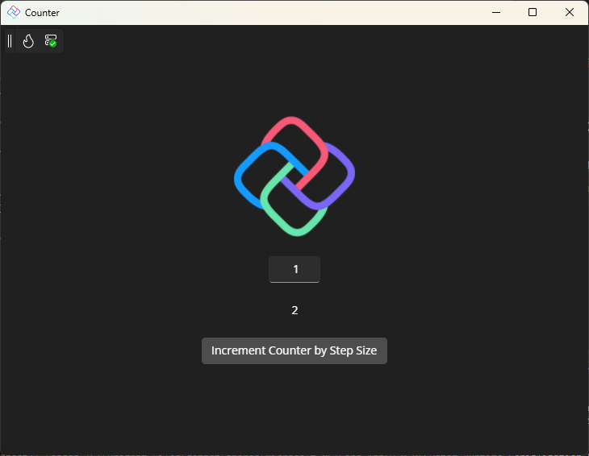

# Counter App

This project is a simple counter application built using the Uno Platform.

### License

This project is licensed under the MIT License. See the `LICENSE` file for details.

## References

- [Uno Platform](https://platform.uno/)
- [Create a Counter App with Hot Design™](https://platform.uno/docs/articles/studio/Hot%20Design/hot-design-getstarted-counter-tutorial.html)
